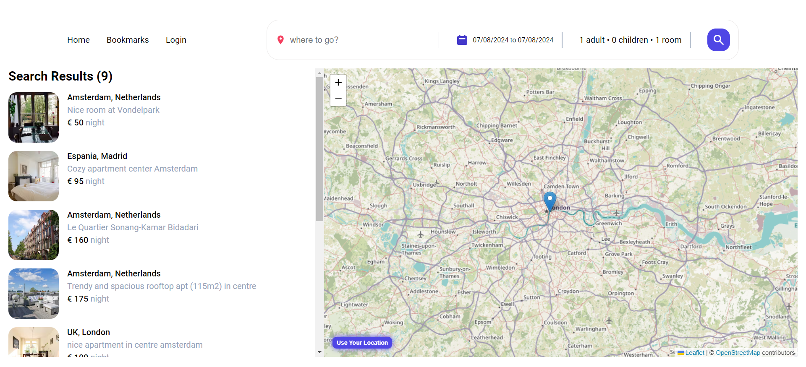

## Preview

<div align="center">



</div>

## Features

- Fetching the list of residences from the database (working with json-server)
- Filter based on travel destination and number of rooms by query string
- Display filter results based on searchParams on the map and display their information to the user
- Choosing accommodation and simultaneously displaying its information and location on the map
- Getting permission to access the user's location
- Clicking on any point on the map, fetching the location information of the desired point and finally adding it to the bookmarks list
- Advanced state management on async actions : context & useReducer
- Fake AuthProvider on app
- Protected Route

## Libraries used

- React.js
- react-router-dom
- axios
- json-server
- react-date-range
- date-fns
- react-leaflet
- react-country-flag
- react-hot-toast
- react-icons

## Setup the project

To set up the project on your localhost, follow the steps below :

#### 1) Clone project

```shell
git clone https://github.com/mrhosseinsalari/Booking-Hotel-App
```

```shell
cd Booking-Hotel-App
```

#### 2) Setup project

```shell
npm install
```

```shell
npm run server
```

```shell
npm run dev
```
